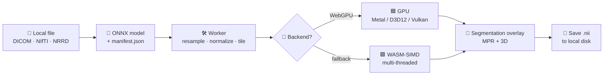
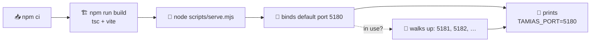
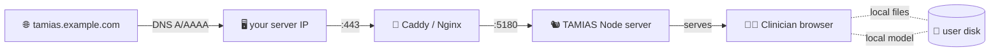
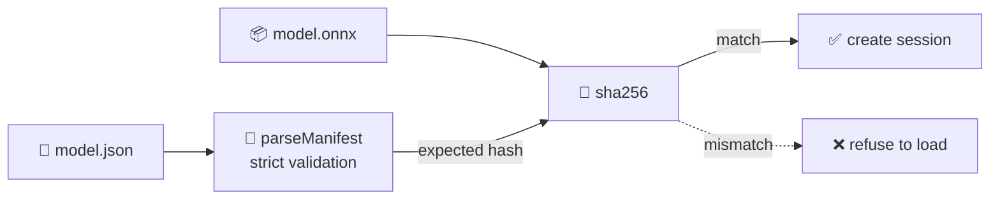

# 🐿️ TAMIAS

> **T**ransparent loc**A**l **M**edical **I**mage **A**naly**S**is Tool — a browser-only PWA that runs ONNX medical-imaging models on local DICOM / NIfTI / NRRD files.
>
> 🛡️ **No upload.** 🌐 **No server-side inference.** 🖥️ **No command-line install for clinicians.** 🔌 **Any GPU vendor via WebGPU.**

<p align="center">
  <a href="#-deploy-on-a-server-clone--run"></a>
  <a href="#-desktop-app-tauri"></a>
  <a href="https://www.w3.org/TR/webgpu/"></a>
  <a href="https://onnxruntime.ai/docs/tutorials/web/"></a>
  <a href="LICENSE"></a>
  <a href="docs/ROADMAP.md"></a>
</p>

<p align="center">
  <a href="https://github.com/ArioMoniri/semikap/releases/latest"></a>
  <a href="https://github.com/ArioMoniri/semikap/releases/latest"></a>
  <a href="https://github.com/ArioMoniri/semikap/releases/latest"></a>
</p>

> 📦 The download buttons above point at the latest GitHub release. Releases are produced by [`.github/workflows/tauri-release.yml`](.github/workflows/tauri-release.yml) on every `v*` git tag. Tag with `git tag v0.1.0 && git push --tags` to trigger a build and publish a draft release with macOS / Windows / Linux artifacts.

---

## ⚡ One-liner install on a server

> 🟦 **Quickstart**
>
> ```sh
> curl -fsSL https://raw.githubusercontent.com/ArioMoniri/semikap/main/install.sh | sh
> ```
>
> Clones the repo into `./tamias`, runs `npm ci && npm run build`, and starts the static server. Look for the line `TAMIAS_PORT=<port>` in the output and point your reverse proxy at that port. See [Configuration](#-configuration-everything-overridable) to override defaults.

---

> ## ✅ No manual edits required — clone & go
>
> 🟢 **Every value the user might need to set has a runtime override** — `PORT`, `HOST`, image tag, ingress hostname, brush colors. There are **no `<your-name-here>` placeholders, no committed secrets, no template tokens to fill in** before first deploy. The literal string `placeholder` appears nowhere in source — only inside `package-lock.json` as part of an upstream Babel package's *name* (`@babel/plugin-proposal-private-property-in-object@7.21.0-placeholder-for-preset-env.2`), which is a transitive dependency of the React build toolchain and is not something you should touch.
>
> If you want to override defaults, see the **[Configuration](#-configuration-everything-overridable)** section. Otherwise, run `npm run setup` (or `docker compose up -d --build`, or `helm install`) and you're done.

---

## 🎯 What it does

A clinician opens a link, picks a local image, picks a local ONNX model + manifest, and sees an AI segmentation overlay rendered on a 3-plane MPR + 3D viewer. **The bytes never leave the device.** Inference runs in the browser via WebGPU (Metal / D3D12 / Vulkan) with a multi-threaded WASM-SIMD fallback.

## 🧭 Pipeline



Every box runs **inside the browser tab**. The only network traffic is the initial bundle download from the server you deploy this on.

## ✨ Features

| | Feature | What it gets you |
|---|---|---|
| 🛡️ | Strict CSP, `connect-src 'self'` | Browser physically cannot upload your images |
| 🌐 | PWA — install with one click | Desktop icon, full offline use after first visit |
| 🖥️ | Native desktop wrapper (Tauri) | Optional .dmg / .msi / .AppImage releases; same browser engine, no chrome |
| 🚀 | WebGPU → WebNN → WASM fallback chain | Any GPU vendor + NPU/ANE/CoreML where available |
| 🖼️ | NiiVue viewer | DICOM, NIfTI, NRRD, MetaImage, MGZ; MPR + 3D out of the box |
| 🌫️ | Gaussian-weighted sliding-window | Eliminates seams at organ boundaries (MONAI σ = patch/8) |
| 🧱 | Tiled 3D inference | Full-resolution CT/MR volumes within browser memory |
| 🎚️ | WW/WL presets (CT lung/bone/brain/…) + opacity + colormap | Live, hardware-accelerated viewer adjustments |
| 🖌️ | Brush + eraser correction | Per-label palette from manifest; undo |
| 🩻 | Multi-series overlay | Load PET on CT, T2 on T1 — second pick, opacity + color controls |
| 📋 | Sidecar JSON manifest | No magic numbers — preprocessing is data-driven and auditable |
| 🔒 | SHA-256 model verification | Optional `sha256` field in manifest is checked before loading |
| 💽 | OPFS warm cache | Cached models keyed by hash, one-click reload, integrity-verified |
| 💾 | Local-disk save via FSA | NIfTI mask + reproducibility-bundle JSON, no download dialogs |
| 🩻 | **DICOM-SEG export** (when source is DICOM) | Round-trip back to PACS as a real Segmentation IOD via dcmjs |
| 🧾 | Reproducibility bundle | Input hash + model hash + manifest + EP chain + per-label volumes |
| 📒 | Local audit log (NDJSON in OPFS) | Every run/export logged on the user's device, exportable |
| ❤️ | `/healthz` endpoint | Cheap liveness/readiness for Kubernetes / Docker / load balancers |
| 🪪 | Per-result RUO stamp | "Research Use Only" badge on every export |

---

## 🚀 Deploy on a server (clone + run)

> The end state is: **clone the repo on a Linux/Mac server, run one command, point a domain at the printed port.**

### Option A — Node only (no Docker)

```bash
git clone https://github.com/ArioMoniri/semikap.git
cd semikap
npm run setup           # = npm ci && npm run build && npm start
```

What `npm run setup` does:



Look for the line printed to stdout:

```
TAMIAS_PORT=5180
Serving dist/ on http://localhost:5180
(bind: 0.0.0.0:5180, COOP/COEP enabled)
```

Then point your reverse proxy / domain at that port. Example **Caddy** (auto HTTPS, COOP/COEP preserved by upstream):

```caddy
tamias.example.com {
  reverse_proxy 127.0.0.1:5180
}
```

Example **Nginx** (preserve COOP/COEP from upstream):

```nginx
server {
  listen 443 ssl http2;
  server_name tamias.example.com;
  location / {
    proxy_pass http://127.0.0.1:5180;
    proxy_set_header Host $host;
    proxy_pass_header Cross-Origin-Opener-Policy;
    proxy_pass_header Cross-Origin-Embedder-Policy;
  }
}
```

> 💡 **Why not just port 80/443?** Bind a privileged port via your reverse proxy. The Node server runs unprivileged on a high port; the proxy handles TLS + low ports.

#### Override the default port

```bash
PORT=8080 HOST=127.0.0.1 npm start
```

If `8080` is taken, the server walks up and prints the chosen port the same way.

### Option B — Docker

```bash
git clone https://github.com/ArioMoniri/semikap.git
cd semikap
docker compose up -d --build
docker compose logs -f tamias    # look for TAMIAS_PORT=…
```

Override the port via env:

```bash
PORT=8080 docker compose up -d --build
```

### Option C — Kubernetes via Helm

```bash
helm install tamias deploy/helm/tamias \
  --set image.repository=ghcr.io/ariomoniri/semikap \
  --set image.tag=latest \
  --set ingress.enabled=true \
  --set ingress.hosts[0].host=tamias.example.com \
  --set ingress.hosts[0].paths[0].path=/ \
  --set ingress.hosts[0].paths[0].pathType=Prefix
```

> 💡 The ingress controller must **preserve `Cross-Origin-Opener-Policy` and `Cross-Origin-Embedder-Policy`** from the upstream — see the comment in `deploy/helm/tamias/values.yaml` for the nginx-ingress snippet.

### Option D — Desktop app (Tauri)

For users who want TAMIAS as a native application instead of a browser tab:

```sh
git clone https://github.com/ArioMoniri/semikap.git
cd semikap
npm ci
npm run desktop:dev          # opens a Tauri dev window with HMR
npm run desktop:build        # produces a distributable .dmg / .msi / .AppImage
```

> ⚙️ **Requires the [Rust toolchain](https://www.rust-lang.org/tools/install) (≥ 1.77)**, plus the Tauri OS prerequisites for your platform (WebKit on Linux, Xcode CLT on macOS, MSVC on Windows). See the [Tauri prerequisites](https://tauri.app/start/prerequisites/) page.
>
> 🚚 You usually **don't need to build locally** — the [Desktop release](.github/workflows/tauri-release.yml) workflow builds and publishes installers automatically when you push a `v*` git tag. Use the download buttons at the top of this README.

### Option E — Run as a systemd service

`/etc/systemd/system/tamias.service`:

```ini
[Unit]
Description=TAMIAS local medical imaging PWA
After=network.target

[Service]
WorkingDirectory=/opt/tamias
Environment=PORT=5180
Environment=HOST=127.0.0.1
ExecStart=/usr/bin/node scripts/serve.mjs
Restart=on-failure
User=tamias

[Install]
WantedBy=multi-user.target
```

```bash
sudo systemctl daemon-reload
sudo systemctl enable --now tamias
journalctl -u tamias -f          # look for TAMIAS_PORT=…
```

### ⚙️ Configuration (everything overridable)

For Node / Docker / systemd deploys, copy [`.env.example`](.env.example) → `.env` and edit. The static server reads `process.env` directly, so a `.env` file is optional — every value has a default.

```sh
cp .env.example .env       # only if you actually want overrides
$EDITOR .env
npm start                  # picks up overrides from your shell or .env
```

| Knob | Where | Default | Notes |
|---|---|---|---|
| `PORT` | env / `.env` | `5180` | Server walks up to first free port if busy |
| `HOST` | env / `.env` | `0.0.0.0` | Set `127.0.0.1` to bind loopback only |
| `NODE_ENV` | env / `.env` | `production` | Standard Node convention |
| Helm `image.repository` | `values.yaml` | `ghcr.io/ariomoniri/semikap` | Your container registry |
| Helm `image.tag` | `values.yaml` | `latest` | Pin to a release tag in production |
| Helm `replicaCount` | `values.yaml` | `2` | App is stateless; scale freely |
| Helm `ingress.hosts[].host` | `values.yaml` | `tamias.example.com` | Your hostname |
| Helm `autoscaling.enabled` | `values.yaml` | `false` | HPA on CPU |

There are no template tokens, secret placeholders, or `<your-name-here>` blanks anywhere in the source. Everything is either runtime-configurable or has a sensible default.

### 🌍 Point a domain at it



---

## 🧠 Bring your own model

TAMIAS does not ship any model weights. The user supplies an `.onnx` (or `.ort`) **plus** a sidecar `.json` manifest that fully describes the preprocessing contract.

```json
{
  "name": "MyLiverSeg",
  "version": "1.0.0",
  "license": "Apache-2.0",
  "modality": "CT",
  "spacing": [1.5, 1.5, 1.5],
  "orientation": "RAS",
  "normalization": { "type": "window", "level": 50, "width": 400 },
  "inference": { "type": "sliding_window", "patch": [128, 128, 128], "overlap": 0.25 },
  "output": {
    "type": "segmentation",
    "labels": { "0": "background", "1": "liver" },
    "colors": { "1": "#22c55e" }
  },
  "sha256": "<optional hex hash of the .onnx file>"
}
```

If `sha256` is present, it's verified against the loaded ONNX bytes before the session is created.



---

## 🛠️ Develop

```bash
npm install
npm run dev           # http://localhost:5173 with HMR
npm run typecheck     # tsc -b
npm run lint          # eslint, max 0 warnings
npm run build         # tsc -b && vite build → dist/
npm start             # node scripts/serve.mjs (serves dist/)
```

The dev/preview servers and `scripts/serve.mjs` all set `Cross-Origin-Opener-Policy: same-origin` and `Cross-Origin-Embedder-Policy: require-corp` so multi-threaded WASM is available. On hosts that don't set those headers, `coi-serviceworker` (loaded by `index.html`) self-promotes the page to a cross-origin-isolated context.

### Repo layout

```
.
├── docs/                  📚 Roadmap & docs
├── scripts/
│   └── serve.mjs          🚀 Production static server (auto-port)
├── src/
│   ├── components/        ⚛️ React UI (shadcn-style + Radix + lucide)
│   │   └── ui/            ⚛️ Reusable Card / Button / Badge / Progress / Separator
│   ├── lib/
│   │   ├── diagnostics/   🔎 GPU / backend probe
│   │   ├── export/        💾 NIfTI-1 writer
│   │   ├── fs/            📂 File System Access API + OPFS cache
│   │   ├── inference/     🧮 ORT setup, manifest, preprocess, sliding window, postprocess
│   │   ├── state/         🗂️ Zustand store
│   │   ├── ui/            🎨 cn() Tailwind composer
│   │   └── viewer/        🖼️ NiiVue wrapper
│   ├── types/             📐 Type vocabulary + global ambient declarations
│   ├── workers/           🧵 inference.worker.ts (Comlink-exposed)
│   └── App.tsx · main.tsx · index.css
├── public/
│   ├── coi-serviceworker.min.js   🛡️ COOP/COEP self-promotion
│   └── favicon.svg
├── .github/workflows/ci.yml       🤖 typecheck · lint · build · artifact
├── Dockerfile · docker-compose.yml
├── vite.config.ts · tailwind.config.js · postcss.config.js
└── eslint.config.js · tsconfig*.json · package.json
```

---

## 🛡️ Privacy posture

- 🔒 **Strict CSP**: `default-src 'self'`, `connect-src 'self' blob: data:` — there is no remote destination the page can reach
- 📂 **Local I/O**: File System Access API on Chromium, drag-drop fallback elsewhere — bytes are read by the page itself
- 💽 **OPFS model cache**, keyed by SHA-256, lets repeat runs skip the re-pick step without uploading anything
- 📴 **Service worker** enables full offline operation after the first visit
- 🪪 **Research Use Only** stamp on every result + export

> See [SECURITY.md](SECURITY.md) for the threat model and reporting.

## 🗺️ Roadmap

See [docs/ROADMAP.md](docs/ROADMAP.md). Phase 1 (this commit): foundation, viewer, WebGPU inference, NIfTI export, PWA, CI.

## 📜 Changelog

See [CHANGELOG.md](CHANGELOG.md).

## ⚖️ License

Apache-2.0 — see [LICENSE](LICENSE).
