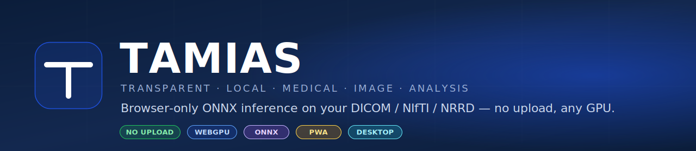
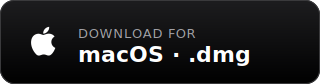
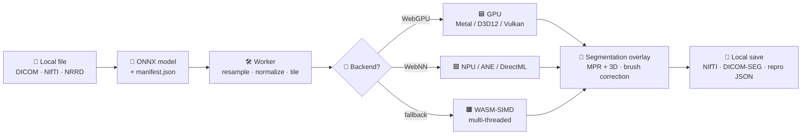
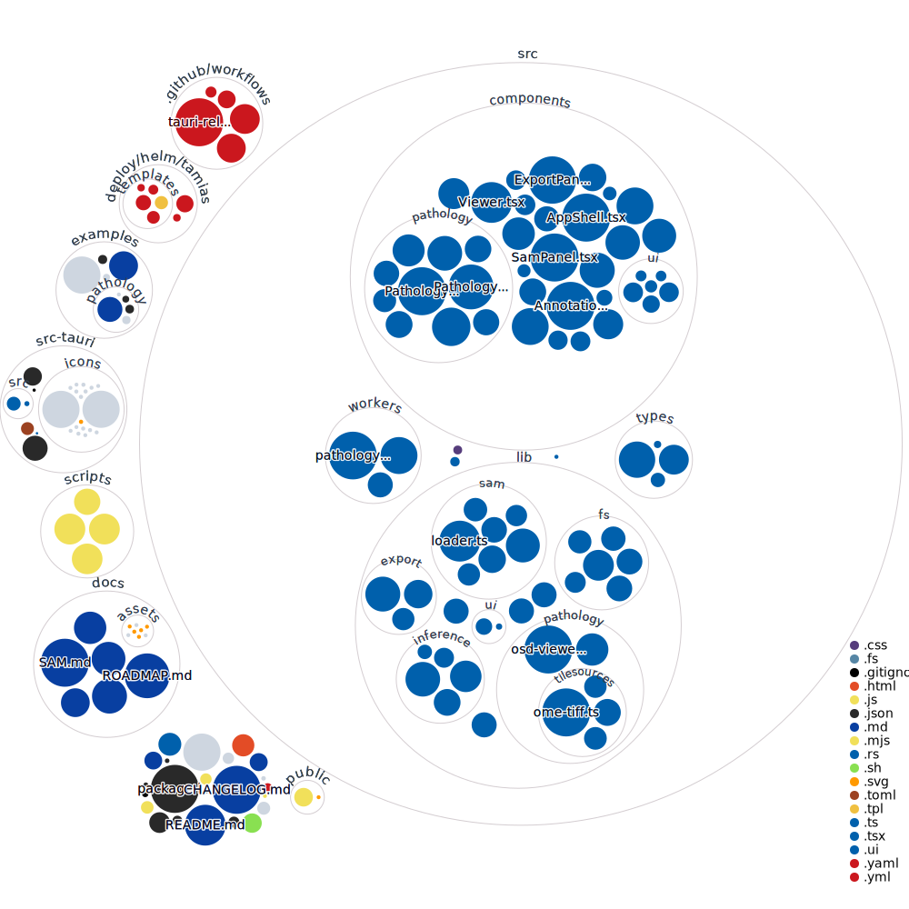

<p align="center">
  
</p>

<h3 align="center">
  Browser-only PWA · ONNX inference · DICOM / NIfTI / NRRD · WebGPU · No upload
</h3>

<p align="center">
  <a href="docs/DEPLOY.md"><strong>📦 Deploy</strong></a>
  &nbsp;·&nbsp;
  <a href="docs/UPDATER.md"><strong>🔄 Auto-update setup</strong></a>
  &nbsp;·&nbsp;
  <a href="docs/ROADMAP.md"><strong>🗺️ Roadmap</strong></a>
  &nbsp;·&nbsp;
  <a href="CHANGELOG.md"><strong>📜 Changelog</strong></a>
</p>

<br/>

<p align="center">
  <a href="https://github.com/ArioMoniri/semikap/releases/latest"></a>
  &nbsp;
  <a href="https://github.com/ArioMoniri/semikap/releases/latest"></a>
  &nbsp;
  <a href="https://github.com/ArioMoniri/semikap/releases/latest"></a>
</p>

<p align="center">
  
  
  
  
  
  
  
</p>

---

## ⚡ One-line install on a server

```sh
curl -fsSL https://raw.githubusercontent.com/ArioMoniri/semikap/main/install.sh | sh
```

Clones the repo into `./tamias`, runs `npm ci && npm run build`, starts the static server. Look for `TAMIAS_PORT=<port>` in the output and point your reverse proxy at that port.

> ✅ **No manual edits required.** Every override has a runtime knob (`PORT`, `HOST`, Helm values, `.env`). The literal string `placeholder` appears nowhere in source — only inside `package-lock.json` as part of an upstream Babel package's name, which is a transitive dependency of the React build toolchain and is not editable.

---

## 🎯 What it does

A clinician opens a link, picks a local image, picks a local ONNX model, and gets an AI segmentation overlay rendered on a 3-plane MPR + 3D viewer. **Bytes never leave the device.** Inference runs in the browser via WebGPU (Metal / D3D12 / Vulkan), with WebNN and a multi-threaded WASM-SIMD fallback.



---

## ✨ Features

| | | | |
|---|---|---|---|
| 🛡️ Strict CSP — no upload | 🌐 PWA install | 🖥️ Tauri desktop builds | 🔄 Sparkle-style auto-updater |
| 🚀 WebGPU + WebNN + WASM | 🌫️ Gaussian-blended tiling | 🧱 3D sliding-window inference | 🎚️ WW/WL CT presets |
| 🖌️ Brush + eraser correction | 🩻 Multi-series overlay | 🔬 Cursor probe (vox · mm · value) | 🌗 Light / Dark / System theme |
| 💾 NIfTI mask export | 🩻 DICOM-SEG export (PACS) | 🧾 Reproducibility bundle | 📒 Local audit log (NDJSON) |
| 💽 OPFS warm cache | 🔒 SHA-256 model verification | ❤️ `/healthz` for K8s probes | 🪪 RUO stamp on every export |

---

## 🚀 Deploy

| Path | Command | When to pick |
|---|---|---|
| **Node only** | `npm run setup` | Single-machine, simplest |
| **Docker** | `docker compose up -d --build` | Single host, containerised |
| **Helm** | `helm install tamias deploy/helm/tamias` | Departmental K8s |
| **systemd** | `systemctl enable --now tamias` | Long-running on a box |
| **Tauri desktop** | `npm run desktop:build` | Native app per workstation |

→ Full setup, reverse-proxy snippets, and configuration table: **[docs/DEPLOY.md](docs/DEPLOY.md)**

---

## 🔄 Auto-updates (Tauri Sparkle-style)

Desktop installs self-update from a **signed** `latest.json` manifest published with each release. Sparkle-style on macOS / Windows / Linux via Tauri's official updater plugin.

**Brand new machine?** Step-by-step from cloning to first release: **[docs/UPDATER.md → "From zero on a brand-new machine"](docs/UPDATER.md#-from-zero-on-a-brand-new-machine)**

**TL;DR for an existing checkout:**

```sh
node scripts/init-updater.mjs    # one-time keypair generation (maintainer)
node scripts/release.mjs minor   # cut + push v0.3.0; CI signs + publishes installers
```

→ Full setup + signing-key flow: **[docs/UPDATER.md](docs/UPDATER.md)**

---

## 📦 Bring your own model

TAMIAS ships no model weights. The user supplies an `.onnx` (or `.ort`) plus a sidecar `.json` manifest:

```json
{
  "name": "MyLiverSeg",
  "version": "1.0.0",
  "license": "Apache-2.0",
  "modality": "CT",
  "spacing": [1.5, 1.5, 1.5],
  "orientation": "RAS",
  "normalization": { "type": "window", "level": 50, "width": 400 },
  "inference": { "type": "sliding_window", "patch": [128, 128, 128], "overlap": 0.25 },
  "output": {
    "type": "segmentation",
    "labels": { "0": "background", "1": "liver" },
    "colors": { "1": "#22c55e" }
  },
  "preferredEP": "webgpu",
  "tta": { "flips": { "x": true } },
  "sha256": "<optional hex hash of the .onnx file>"
}
```

If `sha256` is present it's verified against the loaded ONNX bytes before the session is created.

---

## 🗺️ Repo map

The diagram below regenerates on every push to `main` ([repo-visualizer](https://github.com/githubocto/repo-visualizer) by [GitHub Next](https://githubnext.com/projects/repo-visualization/)). A schematic placeholder is committed to the repo so this image always renders, even before the workflow has run.

<p align="center">
  <a href="docs/assets/repo-visualization.svg"></a>
</p>

---

## 📈 Star history

<a href="https://star-history.com/#ArioMoniri/semikap&Date">
  
</a>

---

## 📚 Docs

- **[ROADMAP](docs/ROADMAP.md)** — phased delivery & what's next
- **[DEPLOY](docs/DEPLOY.md)** — every supported deploy mode + reverse-proxy + configuration
- **[UPDATER](docs/UPDATER.md)** — auto-update setup, signing keys, release flow, **from-zero new-machine guide**
- **[CHANGELOG](CHANGELOG.md)** — release notes
- **[CONTRIBUTING](CONTRIBUTING.md)** — what we accept and the dev loop
- **[SECURITY](SECURITY.md)** — threat model and reporting

## ⚖️ License

[Apache-2.0](LICENSE) © 2026 Ariorad Moniri and TAMIAS contributors.
