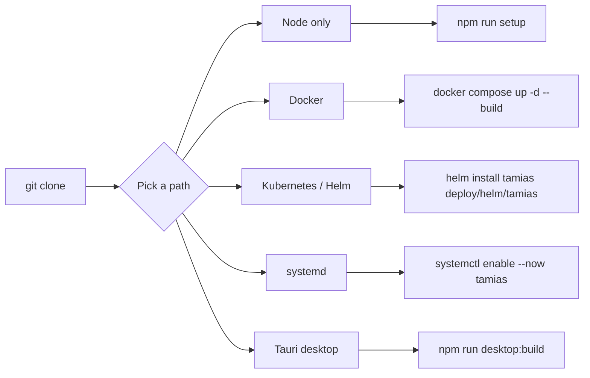
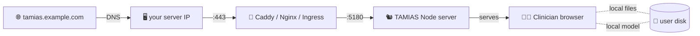

# 🚀 Deploy TAMIAS

TAMIAS is a static PWA — once built, any HTTP server that can set `Cross-Origin-Opener-Policy` and `Cross-Origin-Embedder-Policy` headers can host it. The bundled Node static server (`scripts/serve.mjs`) does this out of the box, picks a default port (`5180`), auto-shifts upward when busy, and prints `TAMIAS_PORT=<port>` to stdout.

## Deploy options at a glance



## Option A — Node only

```sh
git clone https://github.com/ArioMoniri/semikap.git
cd semikap
npm run setup            # = npm ci && npm run build && npm start
```

`npm run setup` prints `TAMIAS_PORT=<port>`. Point a reverse proxy at that port. Examples:

**Caddy:**

```caddy
tamias.example.com {
  reverse_proxy 127.0.0.1:5180
}
```

**Nginx (preserving COOP/COEP from the upstream):**

```nginx
server {
  listen 443 ssl http2;
  server_name tamias.example.com;
  location / {
    proxy_pass http://127.0.0.1:5180;
    proxy_set_header Host $host;
    proxy_pass_header Cross-Origin-Opener-Policy;
    proxy_pass_header Cross-Origin-Embedder-Policy;
  }
}
```

Override the port via env:

```sh
PORT=8080 HOST=127.0.0.1 npm start
```

## Option B — Docker

```sh
git clone https://github.com/ArioMoniri/semikap.git
cd semikap
docker compose up -d --build
docker compose logs -f tamias    # look for TAMIAS_PORT=…
```

Override the port:

```sh
PORT=8080 docker compose up -d --build
```

The image runs as a non-root user, has a `HEALTHCHECK` against `/healthz`, and weighs in around 200 MB.

## Option C — Kubernetes via Helm

```sh
helm install tamias deploy/helm/tamias \
  --set image.repository=ghcr.io/ariomoniri/semikap \
  --set image.tag=latest \
  --set ingress.enabled=true \
  --set ingress.hosts[0].host=tamias.example.com \
  --set ingress.hosts[0].paths[0].path=/ \
  --set ingress.hosts[0].paths[0].pathType=Prefix
```

> 💡 The ingress controller must **preserve `Cross-Origin-Opener-Policy` and `Cross-Origin-Embedder-Policy`** from the upstream. See the comment in [`deploy/helm/tamias/values.yaml`](../deploy/helm/tamias/values.yaml) for the nginx-ingress snippet.

The chart deploys a non-root pod with a read-only root FS, drops every Linux capability, and probes `/healthz` for liveness + readiness. HPA on CPU is opt-in via `--set autoscaling.enabled=true`.

## Option D — Desktop app (Tauri)

For users who want TAMIAS as a native application:

```sh
git clone https://github.com/ArioMoniri/semikap.git
cd semikap
npm ci
npm run desktop:dev          # opens a Tauri dev window with HMR
npm run desktop:build        # produces a distributable .dmg / .msi / .AppImage
```

> ⚙️ Requires the [Rust toolchain](https://www.rust-lang.org/tools/install) (≥ 1.77) and the [Tauri prerequisites](https://tauri.app/start/prerequisites/) for your platform.
>
> 🚚 You usually **don't need to build locally** — the [`.github/workflows/tauri-release.yml`](../.github/workflows/tauri-release.yml) workflow builds and publishes installers automatically when you push a `v*` git tag. Use the download buttons at the top of the README.

## Option E — systemd service

`/etc/systemd/system/tamias.service`:

```ini
[Unit]
Description=TAMIAS local medical imaging PWA
After=network.target

[Service]
WorkingDirectory=/opt/tamias
Environment=PORT=5180
Environment=HOST=127.0.0.1
ExecStart=/usr/bin/node scripts/serve.mjs
Restart=on-failure
User=tamias

[Install]
WantedBy=multi-user.target
```

```sh
sudo systemctl daemon-reload
sudo systemctl enable --now tamias
journalctl -u tamias -f          # look for TAMIAS_PORT=…
```

## Configuration (everything overridable)

For Node / Docker / systemd deploys, copy [`.env.example`](../.env.example) → `.env` and edit. The static server reads `process.env` directly, so a `.env` file is optional — every value has a default.

| Knob | Where | Default | Notes |
|---|---|---|---|
| `PORT` | env / `.env` | `5180` | Server walks up to first free port if busy |
| `HOST` | env / `.env` | `0.0.0.0` | Set `127.0.0.1` to bind loopback only |
| `NODE_ENV` | env / `.env` | `production` | Standard Node convention |
| Helm `image.repository` | `values.yaml` | `ghcr.io/ariomoniri/semikap` | Your container registry |
| Helm `image.tag` | `values.yaml` | `latest` | Pin to a release tag in production |
| Helm `replicaCount` | `values.yaml` | `2` | App is stateless; scale freely |
| Helm `ingress.hosts[].host` | `values.yaml` | `tamias.example.com` | Your hostname |
| Helm `autoscaling.enabled` | `values.yaml` | `false` | HPA on CPU |

## Topology



Every box right of "Browser" is on the user's machine. Bytes never traverse the proxy except for the initial app shell download.
