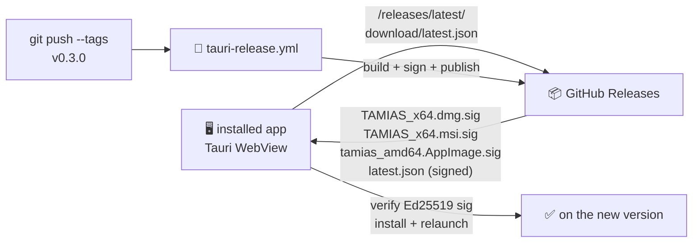

# 🔄 Auto-updates

The TAMIAS desktop app self-updates. On launch (and every 6 hours after) it checks `https://github.com/ArioMoniri/semikap/releases/latest/download/latest.json`. When a newer **signed** bundle is published, the in-app toast offers a one-click "Install update" that downloads, verifies, and relaunches.

This is the same pattern Sparkle popularised on macOS, implemented via Tauri's official updater plugin so it works identically on macOS, Windows, and Linux.

## How it works



## One-time maintainer setup (~2 minutes)

```sh
node scripts/init-updater.mjs
```

This generates an Ed25519 keypair via Tauri's official `signer generate`, writes the **public** key into `src-tauri/tauri.conf.json` (commit it — public keys are safe to publish), and leaves the **private** key in `tauri-signing.key` (which is `.gitignore`-d).

Then add two GitHub Actions secrets to the repo:

| Secret | Value |
|---|---|
| `TAURI_SIGNING_PRIVATE_KEY` | Contents of `tauri-signing.key` |
| `TAURI_SIGNING_PRIVATE_KEY_PASSWORD` | The password you set during generation |

Commit the public-key change and push. Done.

## Cutting a release (~10 seconds)

```sh
node scripts/release.mjs minor    # 0.2.0 → 0.3.0; commits, tags v0.3.0, pushes
node scripts/release.mjs patch    # 0.2.0 → 0.2.1
node scripts/release.mjs 1.0.0    # explicit version
```

The script:

1. Refuses to run if the working tree is dirty or if you're not on `main` (override with `--any-branch`).
2. Bumps the semver in `package.json`, `src-tauri/Cargo.toml`, `src-tauri/tauri.conf.json`.
3. Commits `chore(release): vX.Y.Z`.
4. Tags `vX.Y.Z`.
5. Pushes (override with `--no-push`).

The tag push triggers [`tauri-release.yml`](../.github/workflows/tauri-release.yml), which:

1. Builds installers for macOS-arm64, macOS-x64, Linux-x64, Windows-x64.
2. **Signs each bundle** with the private key from the GitHub secret.
3. Publishes a draft GitHub Release with the installers + `latest.json` (the updater manifest).

Promote the draft to "Latest" in the GitHub UI when you're ready and **every existing install picks the update up automatically** the next time it launches (or within 6 hours).

## Rotating the signing key

Re-run `node scripts/init-updater.mjs` after deleting `tauri-signing.key`. **Existing installs trust only the old public key**, so rotating means existing users must do a manual re-install once. Avoid rotating unless the private key has been compromised.

## Security notes

- The private key never leaves CI; it's mounted into the action only at sign time.
- Each installer includes a sidecar `*.sig` file; the in-app updater rejects any download whose signature doesn't verify against the embedded public key.
- The updater itself only follows the GitHub Releases URL configured in `src-tauri/tauri.conf.json`. Change the endpoint there if you want to host the manifest somewhere else (your own server, S3, etc.).
- Update checks are HTTPS-only.

## Browser PWA updates

The in-browser PWA uses the standard service-worker update mechanism (no signing — the source is the host you deployed on). When a new build is detected, the same toast offers a one-click reload. Background update polling: 60 minutes.
