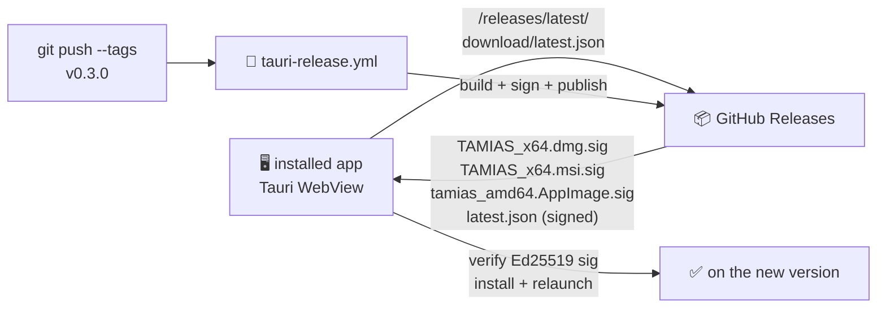

# 🔄 Auto-updates

The TAMIAS desktop app self-updates. On launch (and every 6 hours after) it checks `https://github.com/ArioMoniri/semikap/releases/latest/download/latest.json`. When a newer **signed** bundle is published, the in-app toast offers a one-click "Install update" that downloads, verifies, and relaunches.

This is the same pattern Sparkle popularised on macOS, implemented via Tauri's official updater plugin so it works identically on macOS, Windows, and Linux.

## How it works



## 🆕 From zero on a brand-new machine

If you've only ever interacted with the repo through the GitHub web UI and have nothing on disk yet, this is the full sequence. **Run every command in your local terminal**, not in the browser.

### Prerequisites (install once)

| Tool | Why | macOS install | Windows install | Linux install |
|---|---|---|---|---|
| **Git** | clone the repo | `brew install git` | [git-scm.com](https://git-scm.com/download/win) | `sudo apt install git` |
| **Node 20+** | run scripts, build app | `brew install node@20` | [nodejs.org LTS](https://nodejs.org/) | `nvm install 20` |
| **gh** (optional) | CLI for adding GitHub secrets | `brew install gh` | `winget install GitHub.cli` | `sudo apt install gh` |

Verify:

```sh
git --version    # 2.x
node --version   # v20.x or newer
npm --version    # 10.x
```

### Step 1 — Clone the repo locally

Pick a directory you want the code to live in (e.g. `~/code`):

```sh
mkdir -p ~/code && cd ~/code
git clone https://github.com/ArioMoniri/semikap.git
cd semikap
```

You should now see the project files (`package.json`, `src/`, `docs/`, etc.) when you run `ls`.

### Step 2 — Install dependencies

```sh
npm ci
```

(Takes a minute or two on first run.)

### Step 3 — Generate the updater signing keypair

```sh
node scripts/init-updater.mjs
```

The script will:
1. Prompt you for a password (use a strong one, store it in a password manager).
2. Write `tauri-signing.key` to the current directory (this is `.gitignore`-d — it must NEVER be committed).
3. Patch `src-tauri/tauri.conf.json` with the matching public key.
4. Print the two GitHub secret names you'll add in the next step.

### Step 4 — Add the GitHub Actions secrets

You need to add the secrets the workflow uses to sign each release. Two options:

**Option A — via the web UI** (no extra CLI needed):
1. Open `https://github.com/ArioMoniri/semikap/settings/secrets/actions` in your browser.
2. Click **New repository secret**.
3. Name: `TAURI_SIGNING_PRIVATE_KEY`. Value: paste the **entire contents** of `tauri-signing.key` (open it in a text editor, copy everything).
4. Click **Add secret**.
5. Click **New repository secret** again. Name: `TAURI_SIGNING_PRIVATE_KEY_PASSWORD`. Value: the password you set in Step 3.
6. Click **Add secret**.

**Option B — via `gh` CLI** (faster):

```sh
gh auth login                                                  # if not already
gh secret set TAURI_SIGNING_PRIVATE_KEY < tauri-signing.key
gh secret set TAURI_SIGNING_PRIVATE_KEY_PASSWORD               # paste password when prompted
```

### Step 5 — Commit the public-key change

The public key was written into `src-tauri/tauri.conf.json` in Step 3 — that's safe to commit.

```sh
git add src-tauri/tauri.conf.json
git commit -m "chore: embed updater public key"
git push
```

### Step 6 — (Optional but recommended) Move the private key out of the repo dir

```sh
mv tauri-signing.key ~/.tamias-signing.key   # or anywhere outside the repo
```

You don't need it on disk anymore for normal releases — CI uses the GitHub secret. Keep a backup in a password manager / vault in case you ever need to re-publish a release manually.

### Step 7 — Cut your first release

```sh
node scripts/release.mjs minor    # bumps 0.2.0 → 0.3.0, commits, tags v0.3.0, pushes
```

Watch the Actions tab on GitHub: `https://github.com/ArioMoniri/semikap/actions`. You'll see two workflows kick off:
- **CI** — typecheck / lint / build (fast, ~2 min)
- **Desktop release** — builds + signs installers for macOS / Windows / Linux (~20–40 min)

When the Desktop release workflow finishes, a **draft release** appears at `https://github.com/ArioMoniri/semikap/releases`. Open it, edit the description if you like, and click **Publish release**.

That's it. The download buttons in the README now serve real installers, and every existing desktop install will pick the update up within 6 hours.

### Subsequent releases (every time you ship)

Just one command, from the repo root:

```sh
node scripts/release.mjs patch   # 0.3.0 → 0.3.1
# or:
node scripts/release.mjs minor   # 0.3.0 → 0.4.0
# or:
node scripts/release.mjs major   # 0.3.0 → 1.0.0
```

Then promote the resulting draft release in the GitHub UI.

---

## One-time maintainer setup (~2 minutes)

```sh
node scripts/init-updater.mjs
```

This generates an Ed25519 keypair via Tauri's official `signer generate`, writes the **public** key into `src-tauri/tauri.conf.json` (commit it — public keys are safe to publish), and leaves the **private** key in `tauri-signing.key` (which is `.gitignore`-d).

Then add two GitHub Actions secrets to the repo:

| Secret | Value |
|---|---|
| `TAURI_SIGNING_PRIVATE_KEY` | Contents of `tauri-signing.key` |
| `TAURI_SIGNING_PRIVATE_KEY_PASSWORD` | The password you set during generation |

Commit the public-key change and push. Done.

## Cutting a release (~10 seconds)

```sh
node scripts/release.mjs minor    # 0.2.0 → 0.3.0; commits, tags v0.3.0, pushes
node scripts/release.mjs patch    # 0.2.0 → 0.2.1
node scripts/release.mjs 1.0.0    # explicit version
```

The script:

1. Refuses to run if the working tree is dirty or if you're not on `main` (override with `--any-branch`).
2. Bumps the semver in `package.json`, `src-tauri/Cargo.toml`, `src-tauri/tauri.conf.json`.
3. Commits `chore(release): vX.Y.Z`.
4. Tags `vX.Y.Z`.
5. Pushes (override with `--no-push`).

The tag push triggers [`tauri-release.yml`](../.github/workflows/tauri-release.yml), which:

1. Builds installers for macOS-arm64, macOS-x64, Linux-x64, Windows-x64.
2. **Signs each bundle** with the private key from the GitHub secret.
3. Publishes a draft GitHub Release with the installers + `latest.json` (the updater manifest).

Promote the draft to "Latest" in the GitHub UI when you're ready and **every existing install picks the update up automatically** the next time it launches (or within 6 hours).

## Rotating the signing key

Re-run `node scripts/init-updater.mjs` after deleting `tauri-signing.key`. **Existing installs trust only the old public key**, so rotating means existing users must do a manual re-install once. Avoid rotating unless the private key has been compromised.

## Security notes

- The private key never leaves CI; it's mounted into the action only at sign time.
- Each installer includes a sidecar `*.sig` file; the in-app updater rejects any download whose signature doesn't verify against the embedded public key.
- The updater itself only follows the GitHub Releases URL configured in `src-tauri/tauri.conf.json`. Change the endpoint there if you want to host the manifest somewhere else (your own server, S3, etc.).
- Update checks are HTTPS-only.

## Browser PWA updates

The in-browser PWA uses the standard service-worker update mechanism (no signing — the source is the host you deployed on). When a new build is detected, the same toast offers a one-click reload. Background update polling: 60 minutes.
